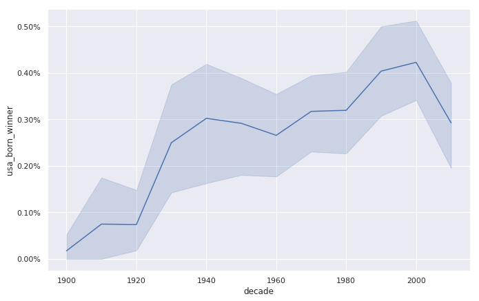
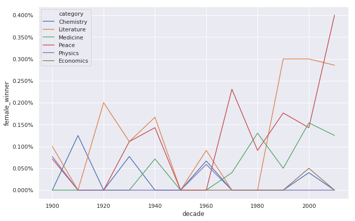

# A Visual History of Nobel Prize Winners
In this project, we will use data manipulation and visualization to explore patterns and trends over 100 years worth of Nobel Prize winners. Specifically, we will try to find answers to the following questions.

* What characteristics do the prize winners have? 
* Which country gets it most often? 
* Has anybody gotten it twice?

## Data
* This dataset includes a record for every individual or organization that was awarded the Nobel Prize since 1901. 
* You can access the <a href="https://www.kaggle.com/nobelfoundation/nobel-laureates">dataset</a> here if you wish.

## Results
USA became the dominating winner of the Nobel Prize first in the 1930s and had kept the leading position ever since.

The plot below is a bit messy as the lines are overplotting. But it does show some interesting trends and patterns. Overall the imbalance is pretty large with physics, economics, and chemistry having the largest imbalance. Medicine has a somewhat positive trend, and since the 1990s the literature prize is also now more balanced. The big outlier is the peace prize during the 2010s, but keep in mind that this just covers the years 2010 to 2016.

The plot below shows us a lot! We see that people use to be around 55 when they received the price, but nowadays the average is closer to 65. But there is a large spread in the laureates' ages, and while most are 50+, some are very young.

We also see that the density of points is much high nowadays than in the early 1900s -- nowadays many more of the prizes are shared, and so there are many more winners. We also see that there was a disruption in awarded prizes around the Second World War (1939 - 1945).

I wanted to give a brief information about the project and results in here. <a href="https://nbviewer.jupyter.org/github/berk77/DataCamp_Projects/blob/main/A%20Visual%20History%20of%20Nobel%20Prize%20Winners/notebook.ipynb">If you want, you can examine the project in more detail here.</a>
