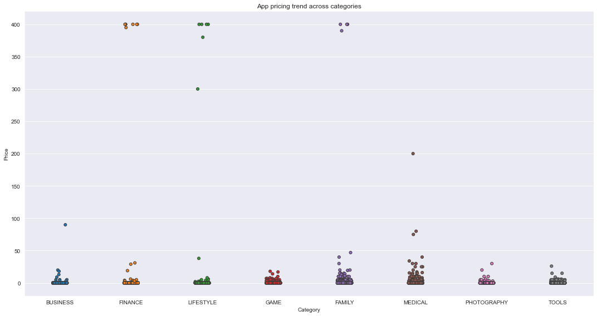
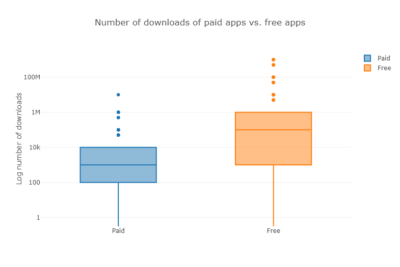
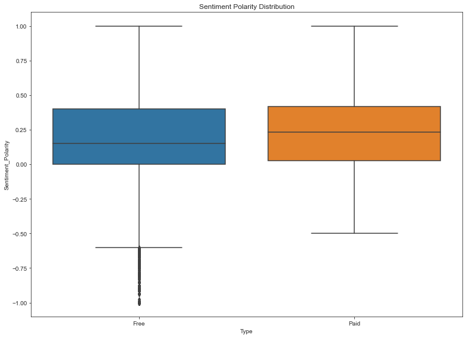

# The Android App Market on Google Play

In this project, a comprehensive analysis of the Android application market is made by comparing more than ten thousand applications on Google Play in different categories. Insights are sought in data to develop strategies to drive growth and retention.For this purpose, the following questions will be tried to be answered.

* Which category has the highest share of (active) apps in the market ?
* Is any specific category dominating the market ?
* Which categories have the fewest number of apps ?
* What is the distribution of app ratings ?
* What is the relation between the size and the price of an app ?
* What is the relation between app category and app price ?
* What is the popularity of paid apps vs free apps ?
* What is the user review sentiment polarity for paid vs. free apps ?

## Data

* <a href="datasets/apps.csv">apps.csv</a> : contains all the details of the apps on Google Play. These are the features that describe an app.
* <a href="datasets/user_reviews.csv">user_reviews.csv</a> : contains 100 reviews for each app, **most helpful first**. The text in each review has been pre-processed, passed through a sentiment analyzer engine and tagged with its sentiment score.

## Data Cleaning

* Specifically, the special characters ',' and '+' present in Installs column and '$' present in Price column have been removed.
* Data types corrected

## Results

* It turns out that paid apps have a relatively lower number of installs than free apps, though the difference is not as stark as we would have expected!

* By plotting sentiment polarity scores of user reviews for paid and free apps, we observe that free apps receive a lot of harsh comments, as indicated by the outliers on the negative y-axis. Reviews for paid apps appear never to be extremely negative. This may indicate something about app quality, i.e., paid apps being of higher quality than free apps on average. The median polarity score for paid apps is a little higher than free apps, thereby syncing with our previous observation.

* Different categories demand different price ranges. Some apps that are simple and used daily, like the calculator app, should probably be kept free. However, it would make sense to charge for a highly-specialized medical app that diagnoses diabetic patients. Below, we see that Medical and Family apps are the most expensive. Some medical apps extend even up to $80! All game apps are reasonably priced below $20.

I tried to give information about the project and results in general.<a href="https://nbviewer.jupyter.org/github/berk77/DataCamp_Projects/blob/main/The%20Android%20App%20Market%20on%20Google%20Play/notebook.ipynb"> If you want, you can examine the project in more detail here.</a>
